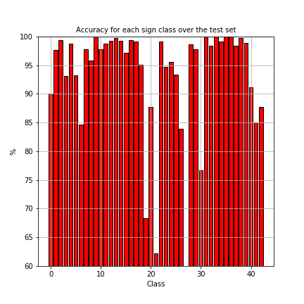
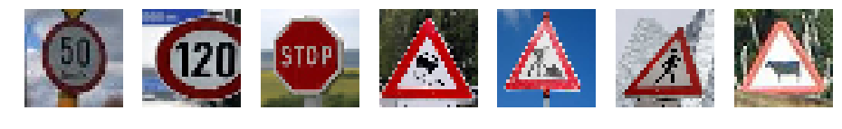
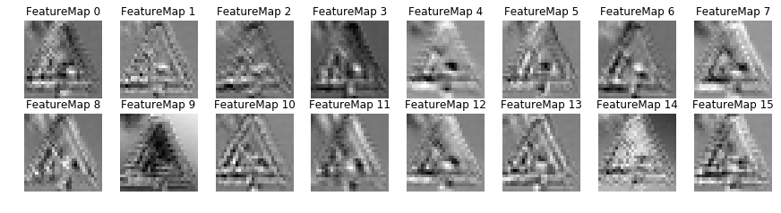
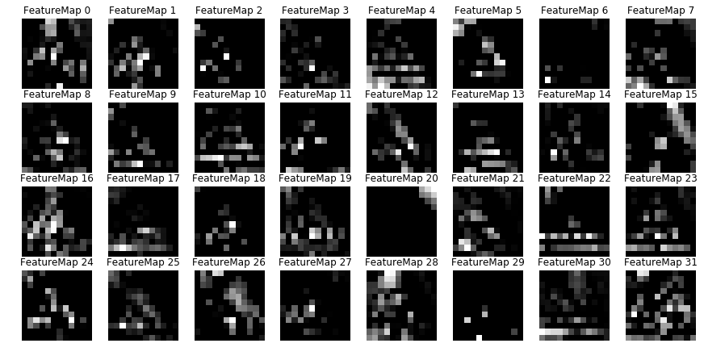
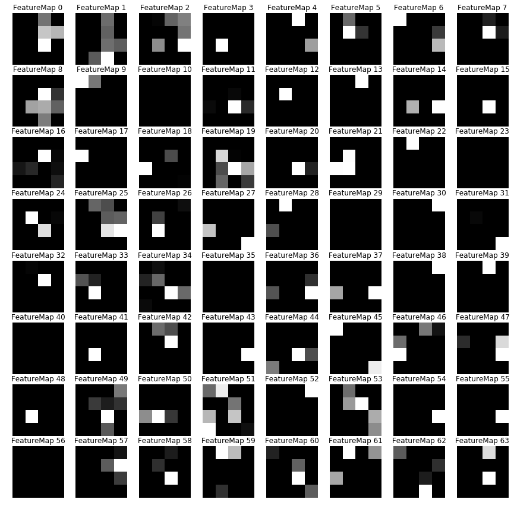

# **Traffic Sign Recognition Project** 


---

In this project, we use what we have learned about deep neural networks and convolutional neural networks to classify traffic signs. Specifically, we train a model to classify traffic signs from the [German Traffic Sign Dataset](http://benchmark.ini.rub.de/?section=gtsrb&subsection=dataset).

The goals / steps of this project are the following:

* Load the data set (see below for links to the project data set)
* Explore, summarize and visualize the data set
* Design, train and test a model architecture
* Use the model to make predictions on new images
* Analyze the softmax probabilities of the new images
* Summarize the results with a written report


[//]: # (Image References)
[image1]: ./Figures/sign.png "An example of sign class"
[image2]: ./Figures/histo.png "Data histograms"
[image3]: ./Figures/preprocess.png "Image before/after preprocessing"
[image4]: ./Figures/LeNetAcc.png "Accuracy of LeNet5 architecture"
[image5]: ./Figures/placeholder.png "Traffic Sign 2"
[image6]: ./Figures/placeholder.png "Traffic Sign 3"
[image7]: ./Figures/placeholder.png "Traffic Sign 4"
[image8]: ./Figures/placeholder.png "Traffic Sign 5"


[Here](https://github.com/ThomasGrelier/Udacity-SelfDrivingCar-P2-TrafficSignClassification) is the link to my jupyter notebook.

## Data Set Summary & Exploration
Input data (download [here](https://d17h27t6h515a5.cloudfront.net/topher/2017/February/5898cd6f_traffic-signs-data/traffic-signs-data.zip)) is composed of 3 pickled data files (.p): one train file, one validation file and one test file.
The pickled data is a dictionary with 4 key/value pairs:
- `'features'` is a 4D array containing raw pixel data of the traffic sign images, (num examples, width, height, channels).
- `'labels'` is a 1D array containing the label/class id of the traffic sign. The file `signnames.csv` contains id -> name mappings for each id.
- `'sizes'` is a list containing tuples, (width, height) representing the original width and height the image.
- `'coords'` is a list containing tuples, (x1, y1, x2, y2) representing coordinates of a bounding box around the sign in the image. **NOTE THAT THESE COORDINATES ASSUME THE ORIGINAL IMAGE. THE PICKLED DATA CONTAINS RESIZED VERSIONS (32 by 32) OF THESE IMAGES.**

I used the numpy library to calculate summary statistics of the traffic signs data set:

* The size of training set is 34799
* The size of the validation set is 4410
* The size of test set is 12630
* The shape of a traffic sign image is (32,32,3)
* The number of unique classes/labels in the data set is 43

On the figure below I plot an example of each of the 43 classes of traffic sign. We can already note that the intensity of the pictures really differ between picture.
![][image1]

On the figure below, we plot histogramps of the labels (0 to 42) for the 3 data sets. Histograms are normalized so as to provide a probability density.
We can see that the histograms look pretty much the same, meaning that the input data has been well randomized.
Some class ids of the traffic signs are more represented like #1 and #2. These labels correspond to the following names: "Speed limit (30km/h)" and "Speed limit (50km/h)".
![][image2]

## Design, train and test a model architecture

### Preprocessing of the data
Three steps of preprocessing were applied: histogram equalization, conversion to grayscale and normalization.
In the lesson on deep learning, we learnt that it is necessary for good working of the neural network that the input data is normalized.
Moreover in the [reference paper](http://yann.lecun.com/exdb/publis/pdf/sermanet-ijcnn-11.pdf) from Pierre Sermanet and Yann LeCun, authors apply global and local histogram equalization to get better result. I just applied global equalization here, as the image is small. Finally their performance turns out to be better  with grayscale pictures than colored pictures, that it is why I chose to work with grayscale images.

- For normalization: I use a simplified normalization : pixel = (pixel-128)/128
- Histogram equalization: I first convert color image to YUV, then apply histogram equalization to the Y-channel thent convert back to colour. For these 3 operations I use opencv functions.

Here is an example of a traffic sign image before and after preprocessing:
![Preprocessing][image3]
 
### Model architecture 
#### Initial architecture
As a starting point I used the LeNet-5 implementation we saw in the classroom at the end of the CNN lesson (see this [link](https://github.com/udacity/CarND-LeNet-Lab/blob/master/LeNet-Lab-Solution.ipynb) for detail). I chose it for the ease of implementation. Indeed it required only a minor modification which is the number ot outputs of the CNN which passes from 10 to 43.
After 20 iterations of training I got a final accuracy of 91% on the validation set. The accucary for training and validation are plotted on the figure below. We can observe some big gap between training and validation curves. This probably means that the model is overfitting the data. We need then to complexify the model architecture to improve the accuracy.
![][image4]

#### Architecture optimization
In the search for model optimization, I assessed several tracks of investigation:

- adding of dropout,
- modification of convolution layer depth,
- implementation of multiscale architecture,
- modification of hyperparameter,
- add of an additional convolutional layer.


__1) Adding dropout layers__

I assessed the impact of adding dropout layers. I tested three different configurations: one dropout, two dropout, three dropout layers. I tested 2 different values for the keep probability. Results are given in the table below. Training / validation accuracy curves are plotted on the following figures.


| Dropout setup         |	keep prob	| Validation accuracy after 100 epochs | 
|:---------------------:|:-------------:|:------------------------------------:| 
| After layer # 4       | 0.5           |                                 0.95 | 
| After layer # 3 / 4   | 0.5           |                                 0.96 |
| After layer # 2 / 3 / 4| 0.5 | 0.969						| 
| After layer # 2 / 3 / 4         | 0.7 |    	0.970						| 

+ One dropout after layer #4, kp=0.5:

+ One dropout after layer #3 and #4, kp=0.5:

+ One dropout after layer #2, #3 and #4, kp=0.5:

+ One dropout after layer #2, #3 and #4, kp=0.7:


We notice that adding one dropout function (before the last FC layer) significantly improves the validation accuracy (95% vs 91% before). However there is still a big gap between training and validation accuracies. Adding a second dropout function improves the validation accuracy furthermore. Adding a third dropout function significantly modifies the training accuracy which is now converging slower and is only 98.5% after 100 epochs vs. ~100% before.
Increasing the keep probability from 0.7 to 0.5 with three dropout layers ends up with a very similar performance to the two-dropout/kp=0.5 case.
We will then choose to add __3 dropout functions with a keep probability of 0.5__.

__2) Increasing convolution layer depth__

I then assessed the impact of increasing convolutional layer depths. I tested two configurations (30-60) and (100-200), the two numbers indicating the depth of the first and second convolutional layer. Results are given in the table below. Training / validation accuracy curves are plotted on the following figures.


| Conv layer depth         |	keep prob	| Validation accuracy after 100 epochs | 
|:---------------------:|:------:|:--------------------------------------:| 
| 6 - 16| 0.5 | 0.97 | 
| 30 - 60         | 0.5 |0.985 |
| 100 - 200         | 0.5 |0.985						| 

+ Conv layer depths 30-60:

+ Conv layer depths 100-200:


Increasing the conv layer depths from (6-16) to (30-60) brings a neat improvement with a validation accuracy jumping from 0.97 to 0.985. __Furthermore deepening the conv layer (100-200) does not improve accuracy but reduces convergence time__.

__3) Adding multiscale__

I tested the multiscale architecture as detailed in the aforementioned paper from Pierre Sermanet and Yann LeCun. The principle is to feed the classifier (fully connected layers) with both first stage and second stage outputs.  The authors justify the interest of this architecture:
>The motivation for combining representation from multiple stages in the classifier is to provide different scales of receptive fields to the classifier. In the case of 2 stages of features, the second stage extracts “global” and invariant shapes and structures, while the first stage extracts “local” motifs with more precise details. 

Results are given in the table below. Training / validation accuracy curves are plotted on the following figures.

| Conv layer depth         | Nb of Dropout |	keep prob	|     Validation accuracy after 100 epochs  | 
|:---------------------:|:------:|:------:|:--------------------------------------:| 
| 6 - 16 + multiscaling|3 |0.5 |  0.958 | 
| 30 - 60 + multiscaling| 3|0.5 | 0.977 | 
| 100 - 200 + multiscaling|3 |0.5 | 0.957  | 
| 6 - 16 + multiscaling|2 |0.5 |  0.959 | 
| 100 - 200 + multiscaling|1 |0.5 |  0.959 | 

+ 6 - 16 + multiscaling+ 3 dropout:

+ 30 - 60 + multiscaling + 3 dropout:

+ 100 - 200 + multiscaling + 3 dropout:

+ 30 - 60 + multiscaling + 1 dropout:


Surprizingly the results are worst than expected. Moreover the performance is better with 30-60 convolutional layers than for 100-200.
If we analyze the accuracy curve for the 100-200 convolutional layer caser with 3 dropouts, we see that the accuracy is increasing quite slowly and with some levels.
__So the results are not concluding for this implementation of multiscale architecture.__


__4) Hyperparameters optimization__

With the "Conv-100/200 single scale 3-dropout" architecture, I tried several configurations for learning rate and batch size.
Results are given in the table below:

| Learning rate |	Batch size	|     Validation accuracy after 100 epochs	      | 
|:---------------------:|:------:|:--------------------------------------:| 
| 0.001| 128 | 0.985 | 
| 0.001| 256 | 0.986 | 
| 0.0001| 128 | 0.981 | 
| 0.005| 128 | 0.944 | 

We notice that the __value 0.001 for the learning rate is the best one__. As for the batch size, there is no noticeable difference between 128 and 256. The simulation time appears to be longer with the 256-batch size, because more memory is needed. 
__We will then keep the value of 128 for the batch size.__

__5) Adding a third convolutional layer__

As a final step of architecture exploration, I assessed the impact of adding a third convolutional layer. 
I tried two different configurations :
+ depth of the three convolutional layers equal to 50, 100 and 200; poolmax averaging only at the ouput of the first layer.
+ depth of the three convolutional layers equal to 16, 32 and 64; poolmax averaging at the ouput of the 2nd and 3rd layers.
+ depth of the three convolutional layers equal to 32, 64 and 128; poolmax averaging at the ouput of the 2nd and 3rd layers.

Results are given in the table below. Training / validation accuracy curves are plotted on the following figures.

| Archi |	Validation accuracy after 100 epochs	      | 
|:---------------------:|:--------------------------------------:| 
| #1 | 0.981 | 
| #2 | 0.991 | 
| #3 | 0.991 | 

+ 50 (max_pool) - 100 - 200 :

+ 16 - 32(max_pool) - 64(max_pool) :

+ 32 - 64(max_pool) - 128(max_pool) :


The second and third architectures bring a significant improvement as compared to the 2-Convlayer architecture we have studied up to now. Adding the max pooling on the second and third layer gives far better results than max pooling the first. __The reason may be that we are losing valuable information by pooling the first layer__.  

__I tried a multiscale version of this architecture by concatenating outputs of first and third convolutional layers but it did not improve the validation accuracy (0.986).__

__6) Input colored images__

Finally I modified the second architecture of previous paragraph to get coloured images as input.
This is easyly done:

- we have to change one parameter of ```preprocess``` function:
```
X_train = preprocess(X_train, hist_eq=1, grayscale=1, norm=1, plot=0)
```

- then we modify the number of inputs of the first convolution layer:
```
    conv1 = convlayer(x, n_f=n_f, d_in=3, d_out=d_out_c1, mu=mu, sigma=sigma, stride=1, padding='VALID', name = 'layer1')
```

Training/validation accuracy are plotted below.
I got a final validation accuracy of 99.1% which is the same as for grayscale images as input. We thus reach the same conclusion as in Pierre Sermanet and Yann LeCun's paper, __that is color does not bring improvement__.


#### Final architecture
My final model consisted of the following layers:

| Layer         		|     Description	        					| 
|:---------------------:|:---------------------------------------------:| 
| Input         		| 32x32x1 Grayscale image   							| 
| Convolution 5x5     	| 1x1 stride, valid padding, outputs 28x28x16 	|
| RELU					|												|
| Convolution 5x5     	| 1x1 stride, valid padding, outputs 24x24x32	|
| RELU					|												|
| Max pooling	      	| 2x2 stride,  outputs 12x12x32				|
| Convolution 5x5     	| 1x1 stride, valid padding, outputs 8x8x64	|
| RELU					|												|
| Max pooling	      	| 2x2 stride,  outputs 4x4x64				|
| Dropout		| keep prob = 0.5        									|
| Fully connected		| outputs = 120        									|
| RELU					|												|
| Dropout		| keep prob = 0.5        									|
| Fully connected		| outputs = 84        									|
| RELU					|												|
| Dropout		| keep prob = 0.5        									|
| Fully connected		| outputs = 43        									|
| Softmax				|         									|

__Parameters for model training:__

- weights were randomly initialized with gaussian distribution, mean = 0 / sigma = 0.1. Biases were initialized to zero.
- learning rate = 0.001
- number of epochs : 100
- batch size: 128
- optimizer: Adam


### Results

My final model reacjes the following accuracy for the different sets:

* training set accuracy of __100%__
* validation set accuracy of __99.1%__
* test set accuracy of __97.5%__

This final accuracy is good. We could still get better accuracy by further exploring the architecture or hyperparameters. But for sure a better method to improve the accuracy is to generate an augmented data set as is reported in Pierre Sermanet and Yann LeCun's paper. This consists in distorting the training data set using different techniques (translation, rotation, scaling, affine transform, contrast, blurring...). 
This technique was not assessed here.

#### Accuracy for each class
I have computed the prediction accuracy for each of the class. The results are plotted below:



We can see that the results really differ from class to class. One class (#21 "double curve") has a really bad prediction accuracy (65.6%). Indeed this class can be easily be mixed with other classes like "wild animal crossing".
Moreover this sign has a quite low appearance rate in the training set (cf. class histogram) which does not help.

## Test the model on new images

### Selection of images on the net

On Google I chose seven pictures of German traffic signs that I found on the web.
I cropped and resized them so as to have 32x32-pixel images in color. Below we plot the images after this preprocessing. 



The images were selected with particularities so as to make classification more challenging. 
Here I the points I identified as potential challenges:

- image 1 (Speed limit 50 km/h): the sign integrates a "km/h" inscription while the model was trained to recognize signs with the number uniquely 
- image 2 (Speed limit (120km/h)): the sign is cropped while I did not train the model with this kind of particularity
- image 3 (Stop): the sign is tilted
- image 4 (Slippery road): the picture may vary depending on the signs for this type of sign class 
- image 5 (Road work): the sign is scratched
- image 6 (Pedestrians): the sign is tilted
- image 7 (Cow crossing): this one is tricky as the model did not learn this kind of class. It learnt the "wild animal crossing" whose animal picture is different.

### Model's predictions 

In the table below we provide our model's predictions for the 7 images we presented before.

| Image			        |     Prediction	        	| 
|:---------------------:|:---------------------------------------------:| 
| Speed limit 50 km/h      		| Speed limit (30 km/h  	| 
| Speed limit (120km/h)     | Speed limit (80km/h 										|
| Stop					| Stop											|
| Road work	      		| Road work					 				|
| Slippery Road			| Slippery Road      							|
| Pedestrians           | Pedestrians           |
| Cow crossing           | Slippery Road           |

Excluding the last sign, the model was able to correctly guess 4 of the 6 traffic signs, which gives an accuracy of 60%. This is really below the accuracy of the test set. The likely reason is that the chosen signs were too difficult to classify as they presented particularities the model was not trained with. To improve accuracy, __training the model with an augmented data set appears to be mandatory__.

### Analysis of the softmax probabilities for each prediction

In the table below, we provide the top 5 softmax probabilities for each image along with the sign type of each probability. 

| Image			| #1 Pred. sign / Proba. 	| #2 Pred. sign / Proba. 	| #3 Pred. sign / Proba. 	| #4 Pred. sign / Proba. 	| #5 Pred. sign / Proba. 	|
|:---------------------:|:-----------------------------:|:-----------------------------:|:-----------------------------:|:-----------------------------:|:-----------------------------:| 
| Speed limit 50 km/h   | 	Speed limit (30 km/h)	| 	Roundabout mandatory	| 	Speed limit (20 km/h)	| 	Speed limit (80 km/h)	| 	Speed limit (40 km/h)	| 
|       		|	4.63e-01		| 	3.44e-01		| 	7.96e-02		| 	3.91e-02		| 	2.46e-02		| 
| Speed limit (120km/h) | Speed limit (80km/h)		| End of speed limit (80km/h)	| 	Speed limit (30 km/h)	| 	Yield			| 	Speed limit (50 km/h)	| 
|       		|	3.41e-01		| 	1.42e-01		| 	1.33e-01		| 	9.38e-02		| 	5.15e-02		| 
| Stop			| __Stop__			| 	No entry		| 	Turn left ahead		| 	Yield			| 	Priority road		| 
|       		|	   9.99e-01  		| 9.96e-06 			|  3.55e-07 			|  1.32e-09  			|  7.09e-10			|
| Road work	      	| __Road work__			| 	Double curve		| 	Wild animals crossing	|Dangerous curve to the left	| Beware of ice/snow		| 
|       		|	  9.98e-01  		| 5.27e-04  			| 4.61e-04  			| 9.95e-05  			|  4.41e-05			|
| Slippery Road		| __Slippery Road__		| 	Wild animals crossing	| 	Speed limit (80 km/h)	| Dangerous curve to the right	| 	Beware of ice/snow	| 
|       		|	  9.97e-01 		|  1.61e-03  			| 1.04e-04  			| 1.02e-04 			|   1.00e-04			|
| Pedestrians           | __Pedestrians__           	|	General caution		|Right-of-way at the next intersection	| Dangerous curve to the right	| Traffic signals		| 	
|       		|	  7.61e-01		|   1.32e-01 			|  4.31e-02 			|  3.91e-02  			|  9.61e-03			|
| Cow crossing          | Slippery road           	| 	No passing		| Dangerous curve to the left	| No passing for vehicles over 3.5 metric tons| Turn left ahead		| 
|       		|	  9.98e-01  		| 1.21e-03 			|  3.52e-04  			| 1.59e-05 			|   1.58e-05			|

  
__Anaysis__
- First image: the model is uncertain about the sign. 4 out of the 5 highest sofmax probabilities concern a speed limit sign but none is the correct one. In second position, we find the "roundabout mandatory" which indeed presents several features at the center of the sign (the curved arrows) as does the input (50 + km/h). Using a color image would have been a way to avoid this kind of misprediction.
- Second image: again the model is uncertain about the sign. The highest probability is a sign limit but not the right one. The model was not robust to the cropping of the image.
- Third, fourth and fith images: the model is sure of its prediction (>99.7%) and indeed it's right!
- Sixth sign: the model predicts well. However it is less certain (76.1%). Indeed the "general caution" sign has a quite high softmax probability (13%). The two signs are quite similare indeed.
- Seventh sign (which is not part of the training set): the model is sure of its prediction (99.8%). The predicted sign (Slippery road) indeed has some similarity with the "cow crossing" sign.

### Visualizing the Neural Network
On the figure below we plot the output of the first, second and third convolutional layers. For each layer, the number of pictures is equal to the layer's depth . Size of the outputs are:

- Conv layer 1: 28x28x16

- Conv layer 2: 14x14x32

- Conv layer 3: 4x4x64

 
The first layer extracts low level features: we can clearly distinguish the edges of the traffic sign and of the sign's picture, here the "road worker"
The second layer which has half the width of the first one, seems to extract the global shape of the sign.
As for the last layer, whose outputs are only made of 16 pixels, it is tricky to interpret. It must be related to very high level features. Each output seems to be focused on a precise locus of the image.

